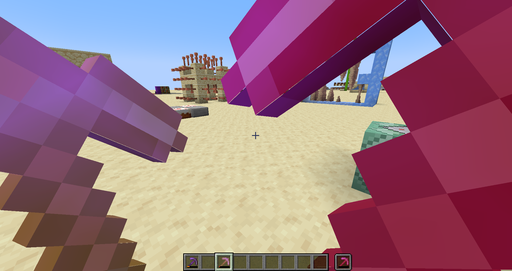

# IDR Pack

This Minecraft Java Edition resource pack renders Items a little bit more noticeable when on low durability.

Useful when you accidentally broke you good mending tools and you dont want it to happen ever again. With this pack you really have to try to look away to not notice it.

## Features

On the left theres a pickaxe with low, but not critical damage value. On the right is the same pickaxe, but with a critical damage value (empty durability bar).

As yo can see, the Items get a **yellow or red flashing color** and get a **bigger rendering model** to occupy a large potion of the screen.
